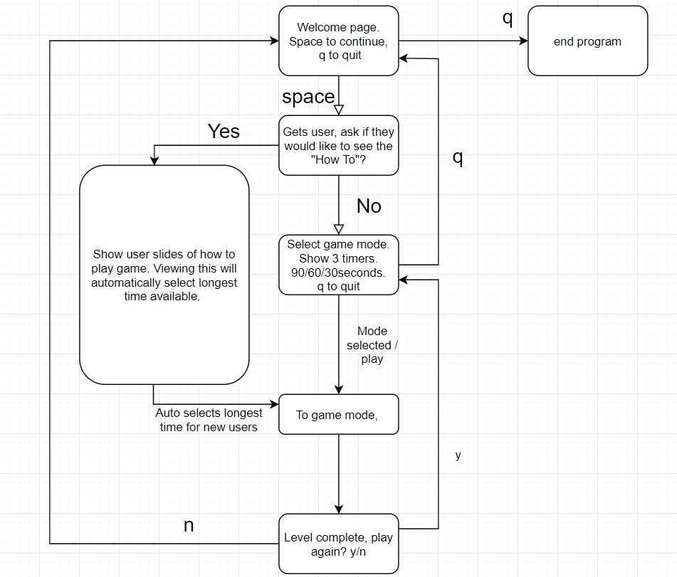

# README

## Twogether

\#NAME

### TWOGETHER

Welcome to 'Twogether', a game where you match two cards together within the given time frame!

1a- The purpose of 'Twogether' is to test and train your memory and have fun doing it! There is a time limit so try to match the cards together as fast and as accurate as possible! You just have to remember to remember!
It will show a board that will require you to match two cards together. There will be 8 pairs scattered over the board. There will be a time limit for each level of the game. The difficulty of the board game will vary based on the time selected by the user!

1b- The reason I am developing 'Twogether 'is so that users may keep their minds sharp and have a good time learning! This will help promote short term memory, and long term fun!

1c- My target audience will be gamers looking for a bit of fun, and also users that are looking to keep their mind powerful and agile.

1d- The user will load the game and will be welcomed by a title screen, introducing them to the wonderful game 'Twogether'. From there, the user will be prompted to input their name. They will then be asked if it is their first (of many) time playing 'Twogether'. If the user selects that it is their first time, they will be taken to a 'how to' tutorial of 'Twogether'. From there, a few screen shots of the game will show across the screen, and then once they are done, the timer will automatically be selected to start at the longest time possible, in order to allow the new user enough time to figure out how to play the game. If it is not the users first time, then they will have 3 available options to select from. Easy - 90 seconds, Normal - 60 seconds, Hard - 30 seconds. The game will then launch, and the user will commence playing. If the user flip all of the cards before the time runs out, a congratulations will appear for them. If the user does not flip all of the cards in time, then they will get a "Try Again" message on the screen. They will then be asked if they want to continue playing, or exit to the main menu.

\#FEATURES

2a Features. 

-The first feature of 'Twogether', will be designing a card back and front. Current deign features two 2's on the back, and then 8 different images that will be printed on two cards each. 
__ENTER IN WHAT CODES USED__

-The second feature will be to have all of the cards interactable by the user so they may click the cards in order to turn them over and guess. 
__ENTER IN WHAT CODES USED__

-The third feature will be an adjustable time limit so that they player can really push themselves, making it easier or hard for themselves. 
__ENTER IN WHAT CODES USED__

\#USER INTERACTION AND EXPERIENCE

3a- Every time that a user runs 'Twogether', they will be prompted with an option to view a 'How To' which will give them instructions on how to play the game and also visuals to help them understand. The majority of the interaction will be clicking the images. Outside of that, the user will be prompted when to use their keyboard. 

3b- The user will be required to click on the cards in the game mode in order to turn them over to see what's on the other side. They will also get the chance to select the timer in which they to select the dificulty of the game. The longer the user selects, the easier it will be. The shorter time the user selects, the harder it will be!

3c- When a user inputs a wrong command, they will be asked again to select a relevant input. They will be prompted with a message that shows them the optional input commands. 

4a- CONTROL DIAGRAM

5a-
input here please tom, thnks 

6a- First significant change for my app 'Twogether' was changing from using coloured words, to cards. Originally I was going to create and app that listed 5 words (Red, Blue, Yellow, Green, Purple) and each of those words would print randomly to the screen in different colours. (See image below)

